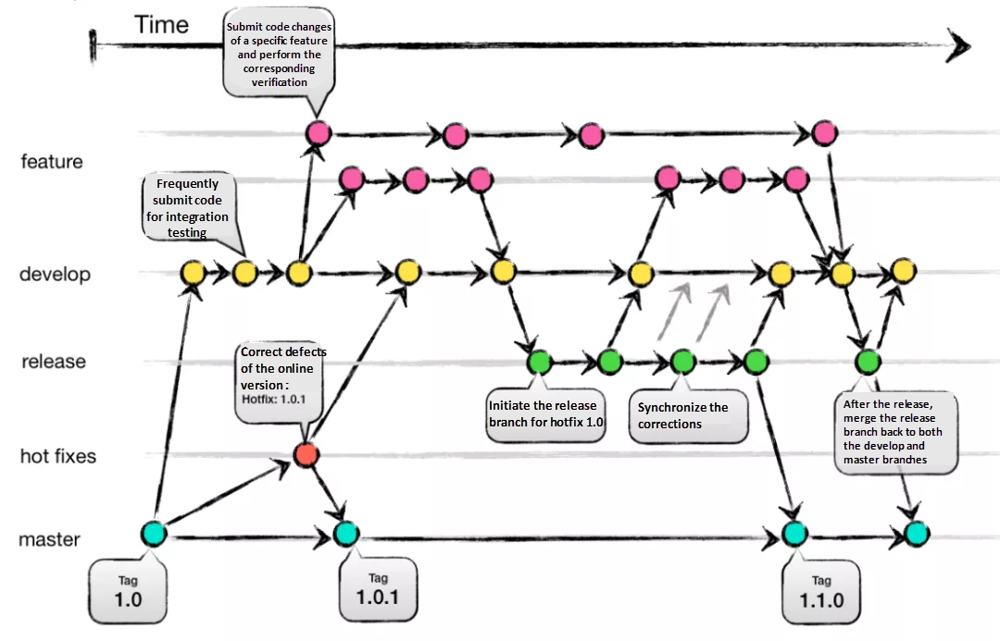
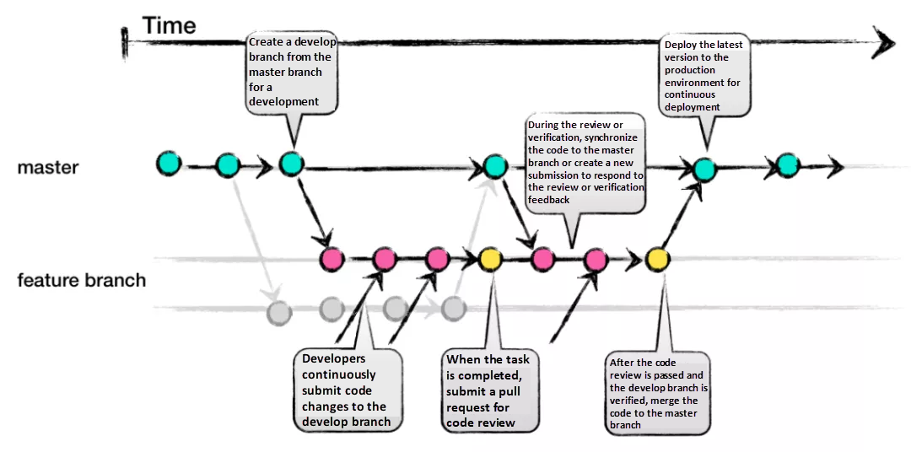

# git 궁금한거 정리
last update : 2024.09.01 (일)
<br>

## git 기본 명령어
 - 기본 명령어
   - git init : 새로운 git 저장소 생성
   - git clone <repository> : 원격 저장소를 복제 후, 로컬에 저장
     - git clone -b <branch_name> <repository> : 특정 branch 복사
   - repository에서 특정 폴더만 복사하는 방법 : https://falaner.tistory.com/86
- 변경사항 관리
  - git status : 현 디렉토리의 상태 확인
  - git add <file> : 변경된 파일을 stage에 저장
  - git commit -m "\<message>\" : stage 변경사항 커밋
- 브랜치 관리
  - git branch : 현재 브랜치 목록 확인
  - git branch <branch_name> : 새 로컬 브랜치 생성
    - 작업 후 git push를 통해 원격에 브랜치 반영 가능
  - git branch -d <branch_name> : 로컬 브랜치 삭제
    - git push origin --delete <branch_name> : 원격 브랜치 삭제
  - git checkout <branch_name> : 지정한 브랜치로 변환
  - git merge <branch_name> : 현재 브랜치에 다른 브랜치(name)의 변경사항을 병합
  - git rebase <branch_name> : 현재 브랜치의 머리를 다른 브랜치(name)의 다음 커밋으로 연결 (내역 간소화)
  - [merge, rebase, squash 정리](https://cjw-awdsd.tistory.com/49)
- 원격 저장소 관리
  - git remote -v : 원격 저장소 url 확인
  - git fetch : 원격 저장소의 변경사항 확인 및 비교
  - git pull : 원격 저장소의 변경사항 로컬에 반영
    - git pull origin <branch_name> : 특정 branch의 변경사항을 로컬에 반영
  - git push : 로컷 커밋을 원격 저장소에 업로드
    - git push --set-upstream origin <branch_name> : branch에서 매번 리모트 브랜치를 지정할 필요가 없도록 고정해 줌 (이후는 git push 동일하게 사용)
- 이력 관리
  - git log : 커밋 이력 확인
  - git log --graph --decorate --all : 커밋과 태그의 히스토리를 그래프 형태로 출력
  - git diff : 변경된 내용 비교
  - git revert <commit_HASH> : 특정 로컬 환경의 커밋을 되돌림
  - git reset --\<type> <commit_HASH> : 원격 저장소를 type에 맞게 지정한 head(해시 위치)로 이동
    - --soft : 인덱스와 작업 디렉터리 유지. 이전 커밋의 변경사항이 staged 상태로 남음
    - --mixed : (기본값) 인덱스 업데이트, 작업 디렉토리는 유지. 이전 커밋은 unstaged로 변경
    - --hard : 인덱스 및 작업 디렉토리 모두 해당 커밋 상태로 초기화. 이 경우 이전 변경 사항은 모두 삭제 (데이터 손실의 위험이 있으니 주의)
- 태그 관리 (branch 처럼 사용 가능한 느낌)
  - git tat : 태그 목록 확인
  - git show <tag_name> : 태그가 가리키는 커밋 내용 확인
  - git tag <tag_name> : 경량 태그 생성
  - git tag -a <tag_name> -m "설명": 주석 태그 생성 (경량 + 추가설명)
  - git tag -a <tag_name> <commit_HASH> -m "설명" : 특정 커밋에 태그 추가
  - git push origin <tag_name> : 태그 푸시
  - git tag -d <tag_name> : 로컬 태그 삭제
  - git push origin --delete <tag_name> : 원격 태그 삭제
  - git checkout <tag_name> : 태그가 붙은 특정 커밋으로 이동
<br><br>

## 주로 발생하는 문제점
 1. 병합 충돌
 2. 잘못된 커밋 메시지 (추후 이력 추적에 문제)
 3. 브랜치 관리
 4. 원격 저장소와의 동기화 문제 (pull, push)
 5. gitignore 파일 관리 (필요하지 않은 파일의 커밋 or 필요한 파일의 누락)
 6. 대용량 파일 관리 > Git LFS 도구 사용
<br><br>

## .gitignore 파일
 - 허용하지 않는 파일
   - 빌드 아티팩트
     - *.o
     - *.exe
     - dist/ (배포 디렉토리)
   - 환경 설정 파일
     - *.env (환경 변수 파일)
     - config/local.json
   - 캐시 파일
     - *.log
     - *.tmp (임시 파일)
   - 의존성 관리 파일
     - node_modules/ (Node.js 의존성) 등등
   - IDE 및 편집기 설정
     - .idea
     - .vscode 등
 - 허용하는 파일
   - 소스코드 파일
     - *.js 등
   - 문서화 파일
     - README.md
     - LICENSE
   - 설정 파일 (필요한 경우)
     - config/config.json (프로젝트 설정)
   - 스크립트 및 툴
     - deploy.sh (배포 스크립트)
     - deploy.yml (YAML 파일 - GitHub Actions)
<br><br>

## GitHub Actions
 - workflow 구조 (yml 파일 예시)
    ```
    name:
    on:
        push:
            branches:
                - main
                - ...
    jobs:
        build:
            runs-on: ubuntu-latest
            steps:
              - name: Checkout code
                uses: actions/checkout@v2
              - name: Deploy to server
                run: |
                echo "Deploying..."
                ...
    ```
<br>

 - Secrets 설정 - [참고](https://velog.io/@meong/Github-Actions%EB%A1%9C-CI-%EA%B5%AC%EC%B6%95%ED%95%98%EA%B8%B0-with-env.yml-%EA%B4%80%EB%A6%AC)
  1. Repository > Settings > Secrets and variables > Actions 에서 "new repository secret" 작성
  2. Actions 에 코드 추가 (secrets.변수명 으로. 참조)
  3. Branch protection rule 설정
     - Action test를 통과해야 merge가 되도록 설정
  - 배포 시간 단축
    - [Action Cache 활용](https://fitpet.medium.com/github-actions%EC%9D%98-%EC%9D%98%EC%A1%B4%EC%84%B1-%EC%BA%90%EC%8B%B1%EC%9D%84-%ED%86%B5%ED%95%9C-%EC%84%9C%EB%B2%84-%EB%B0%B0%ED%8F%AC%EC%86%8D%EB%8F%84-%ED%96%A5%EC%83%81-28cd17ee2e20)
    - [Docker Cache 활용](https://babgeuleus.tistory.com/entry/%EB%B0%B0%ED%8F%AC-%ED%95%98%EB%8A%94%EB%8D%B0-%EA%B1%B8%EB%A6%AC%EB%8D%98-%EC%8B%9C%EA%B0%84-13%EB%B6%84%EC%9D%84-5%EB%B6%84%EC%9C%BC%EB%A1%9C-%EC%A4%84%EC%9D%B4%EA%B8%B0)
<br><br>

## 파트 분배를 위한 branch 관리
  - 브랜치 분리
    - Git Flow 등의 짜여진 구조로 분리
    - main, test, front, back, database 등의 쉬운 구조 등등)
  - only main과 비교했을 때
    - 장점 : 독립적인 작업 가능. 개별 테스트 용이. 버전관리 용이.
    - 단점 : 병합 복잡성. 관리 복잡성
  - env 파일 관리 (bracnh 별로 따로 관리)
    - 브랜치 분리와 같은 이유
    - 단, test에 env_example과 같이 공통 사항을 정해두고 하는 것이 좋음
  - Docker 관리
    - docker compose를 통해 여러 서비스를 동시에 관리
    - 대신 각 파트의 개별환경을 완전히 격리하여 개별 테스트
  - 병합 테스트 (test 브랜치)
    - 브랜치를 통해 로컬 테스트 가능
    - 이후 배포용 main에 올리면 문제점 확인에 용이
<br><br>

## GitHub Branch 관리 전략(규약)
 - Git Flow
   - 
   - main(master)에서 tag로 버전 관리
   - 장점 : 버전 관리 용이(롤백 용이). 명확성. 배포 안정성
   - 단점 : 복잡함(실수 가능성 높음). 느린 릴리스. 유연하지 않은 구조
   - 사용 구조 : 버전 관리가 들어가는 "어플리케이션"에 유리한 구조
 - GitHub Flow
   - 
   - 배포를 위한 main, 개발을 위한 dev(feature)로 나뉨
   - 장점 : 간단한 구조. 유연한 구조. 빠른 배포 및 릴리스
   - 단점 : 배포 위험성 및 관리 어려움. 대규모 프로젝트에 적합하지 않음
   - 사용 구조 : 최종 버전만 사용하는 "웹" 기반에 유리한 구조